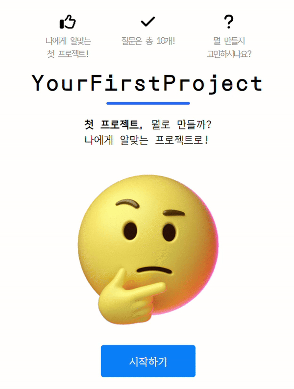

# yourFirstProject

yourFirstProjects는 프론트엔드 개발 초보자들을 위한 리액트JS 프로젝트 추천 사이트 입니다
질문/선택을 통해 사용자에게 가장 적합한 프로젝트를 추천합니다



### 개발 기간

- 5/9 - 5/27


### Project Start

```markdown
- git clone 
git clone https://github.com/gon9009/YourFirstProject.git

- project start 
npm install
```

### Project Skill

```markdown
-React/React-Router
-Context API
-Youtube APi
-Axios
-FontAweSome
```

### Directory Structure

```markdown
-src
│
├─ assets (gif 이미지)
│
├─ components
│ ├── Hooks (커스텀 훅)
│ ├── Layout (공통 레이아웃)
│ ├── MainPage (메인페이지)
│ ├── Questions (질문/선택 페이지)
│ └── ResultPage (결과 추천 페이지)
│
├─ context (스코어 컨텍스트)
│
└─ data (질문/선택지 데이터)
```
